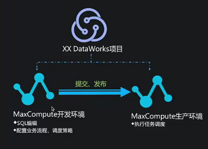
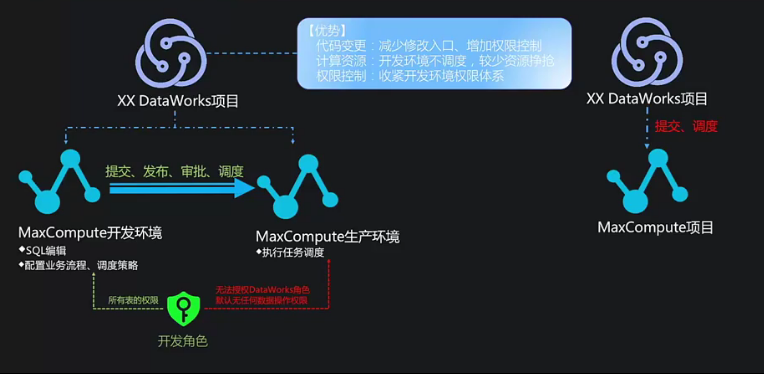
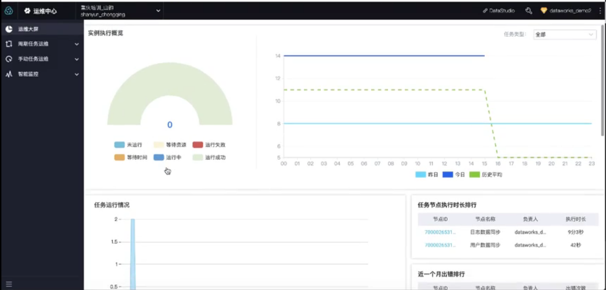
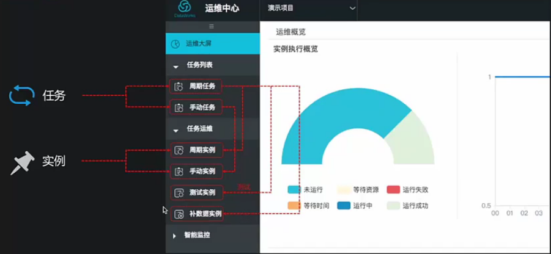
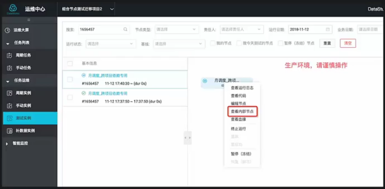
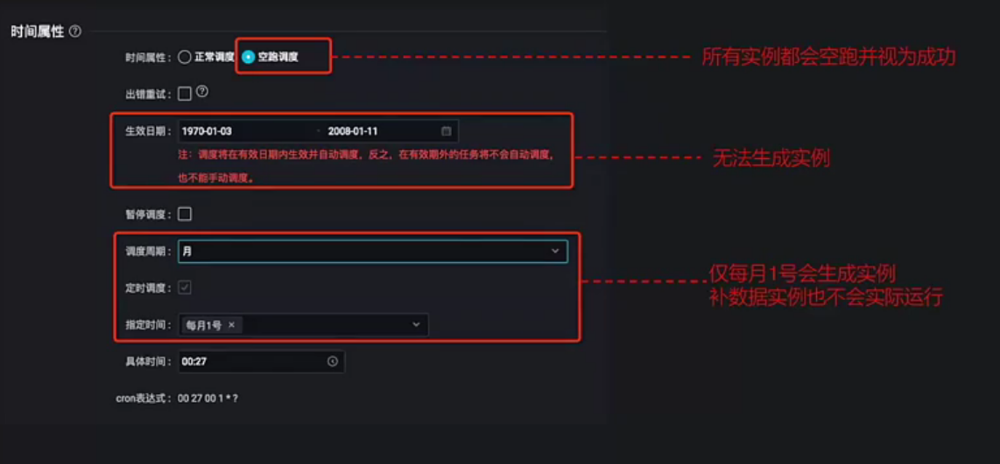

# 常见问题与难点分析
## 依赖关系原理简述
- ### 依赖关系配置
  - sql任务-在sql语句中多句独立语句
    - 这样的方式可扩展性差，缺乏解耦
    - 重跑成本大，不适用复用
  - DataWorks节点可以相互依赖
  - 输出名称
    - 每个节点(task)输出的名称。用户在单个租户（阿里云账号）内设置依赖关系是，链接上下游两个节点的虚拟实体
  - 原则
    - 每个节点必须配置至少一个本节点输出名称、一个父节点输出名称
    - 每个输出点必须在同租户、同region唯一
     
    
  - 依赖模式
    - 手动配置：手工搜索上有节点名称实现；
    - 自动推荐：通过sql血缘找到对应节点名；
    
    - 自动解析：通过sql insert、create、from解析输出名。
    
    - 自动解析原理：
      - 根据insert、create、from自动填写上游输出名与本节点输出名
      - 前提：下游任务的输入表必须是上游任务的产出表
    
  - 实践操作
    - 新建业务流程操作test，添加数据开发中：sql1、sql2、sql3
    
    - 双击打开sql1表，可以看到tb_1是输入表，tb_2是产出表，tb2的数据是由tb_1加工而来。同理后面两张表的逻辑也是如此。
    
    - 进入sql1表配置，选择自动解析是。可以看到对应自动解析结果，当点击提交时，会显示提示失败，tb_1解析失败，原因是他没有上游节点。
    
    - 选中tb_1右键删除输入，会阻止对该表的自动解析，点击保存
    
    - 同理另外两张同理操作，不需要阻止表解析，再次点击提交后，成功
    
    
    
    
    - 当自动解析无法满足我们使用的时候，可以选择否，搜索或者使用推荐的方法进行
  - 手动进行配置
    - 最简单的就是拖动拉线，然后进入配置栏就看到进行了关联，没拉前是空的，比较直观
    
    
    - 当没有时，怎么配置呢？先找到上游节点配置中的输出名，复制
    
    - 进入下游节点配置，在依赖的上游节点进行粘帖搜索添加，添加完成后返回流程刷新，就可以看到连线
    
    
  - 自动推荐依赖关系配置
    
    - 选择自动解析否，可以看见自动推荐按钮，点击后弹出所有上游节点输出项，选择对应输出节点，确定可以看到对应节点已经关联，点击保存
    
    
  - 常见问题解析
    - 自动解析提交失败，报错：依赖的父节点输出projectname.table不存在，不能提交本节点，请先提交父节点。
    
      - 1、上游节点未提交，提交后可再次尝试
      - 2、上游节点已经提交，但是上游节点的输出名不是workshop_yanshi.tb_2
      - 当前阿里云账号（同region）下，必须存在一个拥有workshop_yanshi.tb_2输出名的节点已提交
    - 为什么本节点的输出中，下有节点名称、下游节点id、责任人都是空且不能填写内容？
      - 原因是没有其他任意一个节点依赖于该输出名
      - 只有该输出名被依赖，且依赖它的节点被提交，此处才会自动解析出相关信息
    
    - 使用自动解析依赖关系时，如何不解析到中间表？
      - 除了在sql代码中对表名邮件“删除输出、删除输入”之外
      - 还可以下配置中心中约定中间表前缀，符合规则的中间表将不会被解析
    

- ### 标准模式解析
  - 标准模式介绍
    - 前期都是单个项目对应一个MaxCompute项目
    - DataWorks中标准模式
    
  - 标准模式与简单模式区别、有事
    - 标准模式：
      - 开发角色：开发环境——》提交、发布、审批、调度——》生产环境
      - 开发角色：所有表的权限、无法授权DataWorks角色默认无任何数据操作权限
    - 普通模式：
      - 直接提交、调度
    - 优势：
      - 代码变更：减少修改入口，增加权限控制
      - 计算资源：开发环境不调度，较少资源争抢
      - 权限控制：收紧开发环境权限体系
    
  - 注意事项
    - 如果是标准模式，仅能够发布至本身绑定的生产环境
- ### 运维中学技巧使用
  - 版面概述
    
  - 周期任务运维
  - 手动期任务运维
    
  - 组合节点
    
  - 注意事项
    - 当时间属性中设置为空跑调度时，多有实例都会空跑，并且视为成功。
    - 调度将在有效日期内生效并且自动调度，反之，在有效期日期外的不会自动调度也不会自动调度
    - 调度指定周期和时间后，只会在该周期的指定时间生成实例，补数据实例也不会实际运行
    