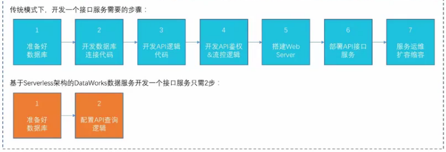
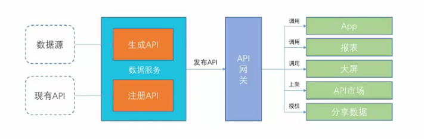
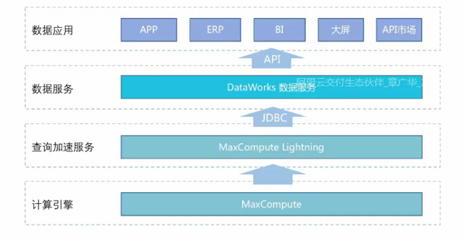
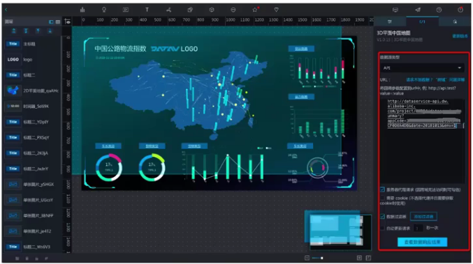
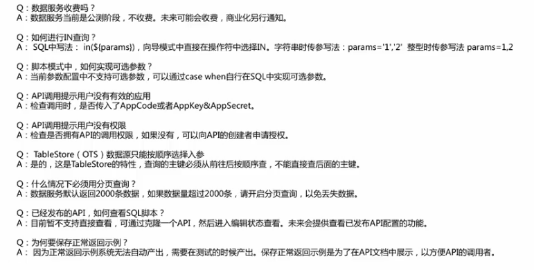
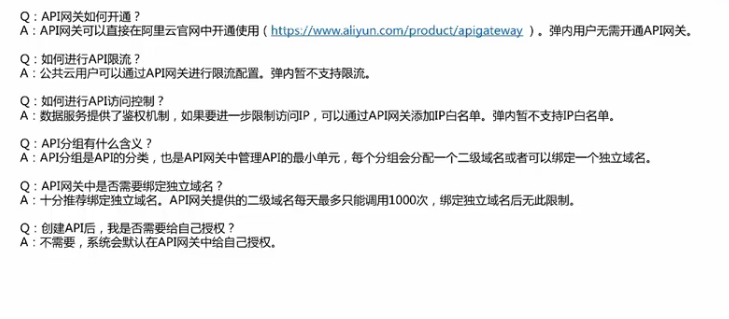
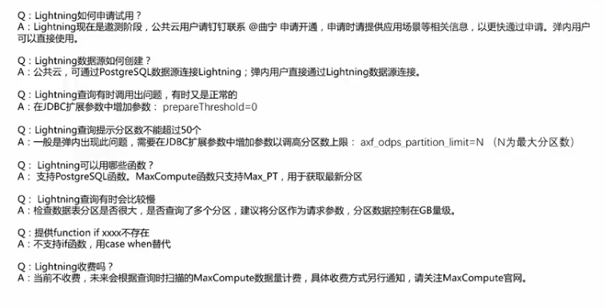

- # DataWorks全链路云研发平台
    - 构建了从数据集成、数据开发、数据服务到应用开发的全链路云研发平台
    - DataWorks数据服务产品优势
      - 零代码
      - 零运维
      - 动态扩展
    - 
    - 数据服务应用场景
      - 支持生成API和注册API，并与API网关（api gateway）一键打通，可以将api发布到API网关。可以在应用、报表、大屏中调用，上架到阿里云api市场销售，或者授权给其他人分享数据。
    - 
    - 数据服务功能解析
      - 配置数据源-生成api（注册api）-发布api-授权api-调用api
      - 支持生成api的数据源：全面支持在线存储（包含关系型数据库和NoSQL）和离线存储的数据源（MaxCompute）
        - MaxCompute Ligihtning是MaxCompute产品的交互式查询服务：兼容postgresql、提升性能、统一权限管理、开箱即用按查询付费
      - 通过Lighening 查询家属直接将MaxCompute表生成api
    - 
      - 可视化导向模式生成api（零代码生成api）：支持可是话配置生成api，零代码，分析师及业务人员也会用
      - 自定义Sql模式生成api：支持自定义sql脚本
      - 支持编写Python脚本对api结果进行二次加工（后置过滤器）
      - 注册api：将有的api注册到数据服务，统一管理，统一发布，统一管理
      - 自动生成详实的api文档
      - 一键发布至api网关，提供api调用sdk
      - api授权：api列表更多中操作，支持授权他人使用，对方云账户id
      - aip授权管理：可以查看授权的api和管理授权给他人的api
      - api调用鉴权
      - 向导模式生成api
      - 脚本模式生成api
      - 生成的api在DataV中应用
    - 
    - 数据服务FAQ
    - 
    - 
    - 
