# DataWarks原理知识
dataworks基础知识介绍+实操培训

- ## DataWorks大数据开发平台架构

  - ### 数据集成-全域数据汇集
    - 20+种数据源
      - 关系型数据库、大型数据存储、非结构化存储、NoSql数据库等，涵盖了90%以上的常用数据源
    - 支持经典专有、混合等网络环境
      - 集团外或者集团内
      - 阿里云数据库实例或本地部署
      - 公网可访问或不可访问
    - 可视化配置与监控
      - 向导模式
      - shell+DataX
    - 支持多种同步方式
      - 实时或者批量
      - 全量或者增量
      - 同步速度视资源组而定，可横向扩展
  - ### 数据集成-大数据的搬运工（任意数据源、任意格式、任意位置、任意复杂网络环境下的高效数据采集传输）
    - 通过对以下数据抽取转换
      - 关系型数据库
            - SQL Server/PostergreSQL/梦达/DRDS/MYSQL/oracle/rds for ppas/db2
      - MPP
            - HybridDB for Mysql/HybridDB for PostgreSQL
      - 大数据存储
          - Maxcompute/HDFS
      - 非结构化存储
          - OSS/FTP/多媒体文件
      - NoSql
          - HBASE/OTS/MongoDB
    - 可跨公网，实时/离线导入
    
  - ### 数据研发-DataStudio千万级人物调度能力
      - DataStudio（DataWorks大数据综合数据开发工作室XStudio的核心-DataStudio：支持流批一体、AI、交互式查询和自定义引擎节点等跨赢取混编工作流可视化开发运维环境，可提供妙计可传参条件判断分支循环依赖大规模强保障周期调度能力的大数据综合开发工作平台，包括：大规模调度Alisa,智能运维，统一元数据等）
      - 更友好、更高效、更智能的IDE
          - 产品交互升级，全新炫酷皮肤，更易用
          - 编辑器SQL输入智能提示，代码格式化和折叠
          - SQL结构可视化展示和定位
      - 拖拽式可视化DAG开发模式
          - 基于DAG模式，提供可视化组件拖拽式流计算
          - 任务“零代码”开发
      - 新增循环判断控制节点
      - 实时转实例，无需再等T+1生效
      - 新增自定义节点
    
  - ### 数据治理-常见问题
      - 数据信息分散
            - 业务系统不清晰，数据资产不明晰
      - 元数据不全
            - 需要有业务接口人，能维护补全业务信息
      - 数据质量差
            - 上传来的是一张空表，或者无效字段，总靠人肉来判别
      - 维护困难
            - 数据有问题，总是事后才知道，该由谁去维护预防
      - 审计信息
            - 用数据的人那么多，如何保障数据访问是可靠安全的
    
  - ### 百万任务、千万表 应该如何管理？
      - 痛点：
    
      - 智能监控能力升级
        - 智能识别关键路径，合理设定报警阀值
        - 任务异常产生事件，自动评估事件影响范围，通知相应人员
        - 灵活报警方式配置，支持钉钉群机器人
      - 运维中心：智能监控
  - ### 数据质量-DQC
    - 数据质量，属于数仓中最常见问题，在整个流程中随时可能发生，严重影响数仓落地。
    - 解决数据质量问题，除了依托工具，还需要从管理整个体系做支撑，能够责任落实到人，完善监督发现机制。
    - 依托DataWorks数据质量监控，全程监控数据加工流水线，根据质量规则及时发现问题，通过强弱报警通知开发同学及时处理问题。
    

  - ### 数据治理-数据保护伞
    
  - ### 数据服务
    - DataWorks数据云上托管服务中心-数据服务：支持弹性伸缩的，高稳定QPS的，多数据源多协议的，Serverless服务编排的，云上数据托管API服务平台，包括：可视化生成API，自定义SQL生成API，函数计算，服务编排等，致力于数据服务化，数据共享和开放。
     


- ## DataWorks实战安排
  场景：海量日志分析
  - 数据集成、数据开发、数据分析、运维中心、数据质量、数据服务、数据服务 

  - 开通地址:https://data.aliyun.com/product/ide?spm=5176.10695662.881989.1.52434695XIl4Yx
  - ### 开通过程：  
    - #### 目前按量付费，开通不需要付费，基础版免费
  
  
  
    - #### 需要选工作空间的计算引擎服务，仍然需要开发按量付费功能，开通免费；然后勾选该服务进行下一步。
  
    - #### 需要填写实例显示名称，创建实例
  
    - #### 稍等片刻成功后，点击进入数据开发
  

  - ### 业务实战
    - #### 进入开发控制台后，新建业务流程：海量日志分析
   
   
   
    - #### 操作界面，在通用菜单找到-虚拟节点，拖动到画布，新建开始节点
   
   
    - #### 在数据集成中拖入两个-离线同步组件，分别命名为oss日志数据同步、rds用户数据同步
   
   
   
    - #### 对-开始组件连接-离线同步组件，双击-开始进入后选择调度配置
   
   
    - #### 修改发布后生效，并使用工作空间根节点，点击保存
   
    - #### 返回主界面，点击进入数据集成页面
   
  
    - #### 点击数据源管理，新增数据源
  
    - #### 新增半结构化下的oss数据源，并测试联通
    - #### 详情参看：https://help.aliyun.com/document_detail/146754.html?spm=5176.11065259.1996646101.searchclickresult.62e15ebapVxaKt
  
  
    - #### 同理完成MySql的新建
  
    - #### 返回主界面，双击进入日志数据，根据步骤填入数据源（具体填写参考help详情链接）、字段映射、通道控制
  
    - #### 在数据去向中选择ODPS,根据文档中方法创建两张表
  
    - #### 新建表
        - 在数据开发页面打开新建的业务流程，右键单击MaxCompute，选择新建 > 表。在新建表对话框中，输入表名，单击提交。此处需要创建2张表（ods_raw_log_d和ods_user_info_d），分别存储同步过来的OSS日志数据和RDS日志数据。

      - 通过DDL模式新建表。
      新建ods_raw_log_d表。
      双击ods_raw_log_d表，在右侧的编辑页面单击DDL模式，输入下述建表语句。
  
    ```sql
      --创建OSS日志对应目标表
      CREATE TABLE IF NOT EXISTS  ods_raw_log_d (
          col STRING
      )
      PARTITIONED BY (
          dt STRING
      );
    ```
    - #### 新建ods_user_info_d表。 双击ods_user_info_d表，在右侧的编辑页面单击DDL模式，输入下述建表语句。
    ```sql
      --创建RDS对应目标表
      CREATE TABLE IF NOT  EXISTS ods_user_info_d (
          uid STRING COMMENT '用户ID',
          gender STRING COMMENT '性别',
          age_range STRING COMMENT '年龄段',
          zodiac STRING COMMENT '星座'
      )
      PARTITIONED BY (
          dt STRING
      );
    ```
    - #### 建表语句输入完成后，单击生成表结构并确认覆盖当前操作。返回建表页面后，在基本属性中输入表的中文名。完成设置后，分别单击提交到开发环境和提交到生产环境。
  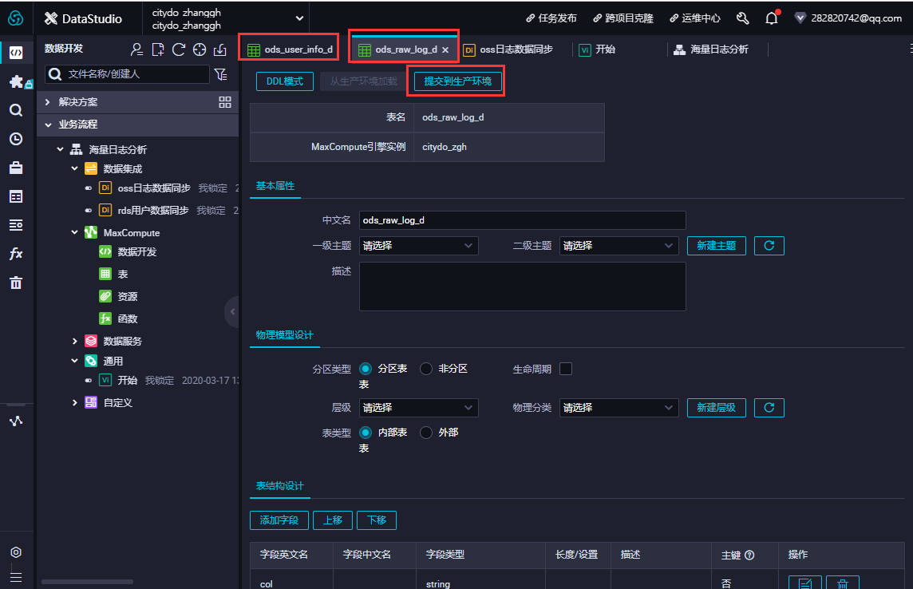
    - #### 打开日志数据同步，在数据去向中选择刚才新增的ods_raw_log_d，可选择限流10MB/s
  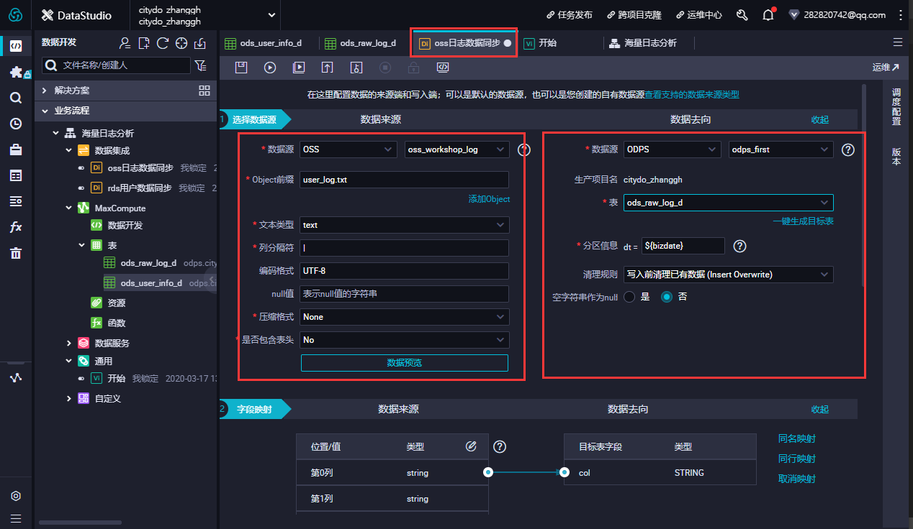
    - #### 同理打开用户数据同步，数据曲线选择ods_user_info_d，可选限流10MB/s，进行保存
  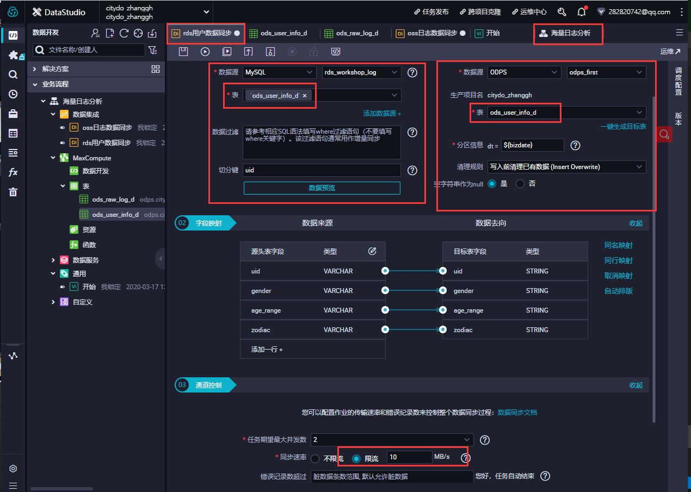
    - #### 进入主界面海量日志分析，点击运行，右键日志数据同步可查看运行日志
  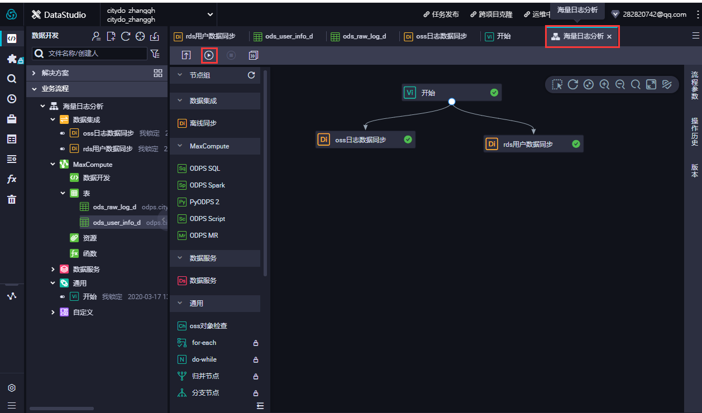
  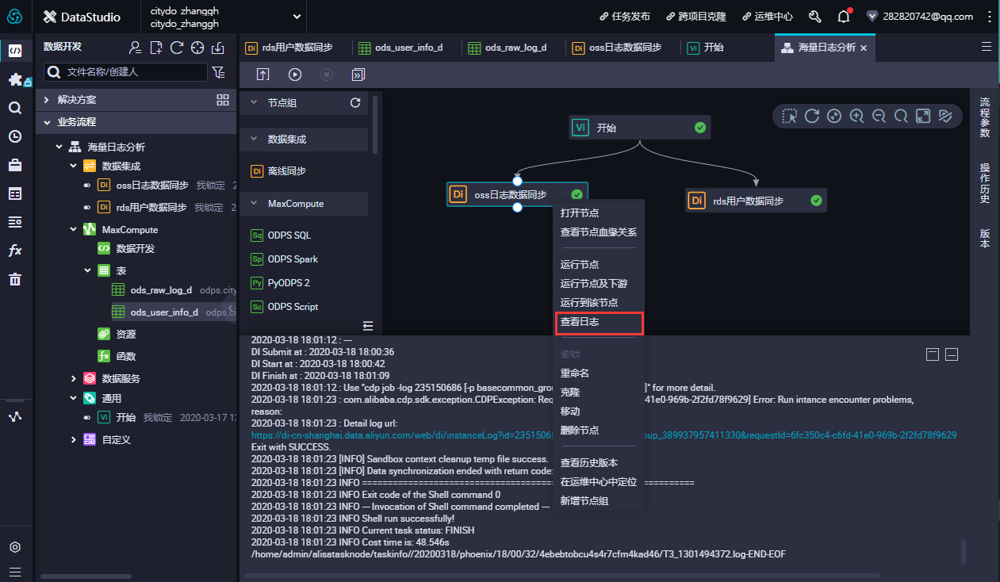
    - #### 点击放大镜，可以新建临时sql，进行查询，可看到相关数据已经写入
  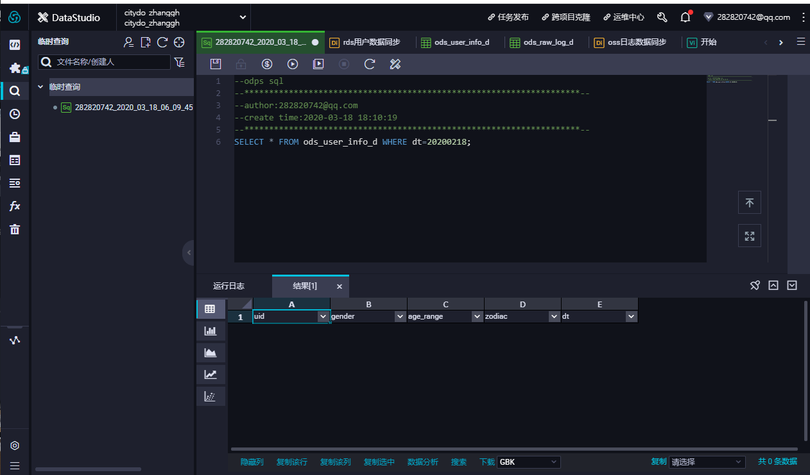
    - #### 返回主界面，再次拖入三个sql组件，日志数据清洗、用户和日志数据汇聚、用户画像分析。进行关联后，可点击进行自动排序
  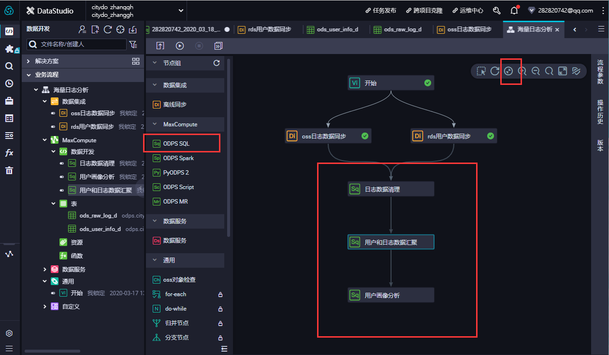
    - #### 新建对应的三张数据表
    - 在数据开发面板，打开新建的业务流程，右键单击MaxCompute，选择新建 > 表。在新建表对话框中，输入表名，单击提交。此处需要创建3张表，分别为ODS层表（ods_log_info_d）、DW层表（dw_user_info_all_d）和RPT层表（rpt_user_info_d）。
    - 通过DDL模式新建表。新建ods_log_info_d表。双击ods_log_info_d表，在右侧的编辑页面单击DDL模式，输入下述建表语句。
    ```sql
    --创建ODS层表
    CREATE TABLE IF NOT EXISTS ods_log_info_d (
      ip STRING COMMENT 'ip地址',
      uid STRING COMMENT '用户ID',
      time STRING COMMENT '时间yyyymmddhh:mi:ss',
      status STRING COMMENT '服务器返回状态码',
      bytes STRING COMMENT '返回给客户端的字节数',
      region STRING COMMENT '地域，根据ip得到',
      method STRING COMMENT 'http请求类型',
      url STRING COMMENT 'url',
      protocol STRING COMMENT 'http协议版本号',
      referer STRING COMMENT '来源url',
      device STRING COMMENT '终端类型 ',
      identity STRING COMMENT '访问类型 crawler feed user unknown'
    )
    PARTITIONED BY (
      dt STRING
    );
    ```
    - 新建dw_user_info_all_d表。双击dw_user_info_all_d表，在右侧的编辑页面单击DDL模式，输入下述建表语句。
    ```sql
    --创建DW层表
    CREATE TABLE IF NOT EXISTS dw_user_info_all_d (
      uid STRING COMMENT '用户ID',
      gender STRING COMMENT '性别',
      age_range STRING COMMENT '年龄段',
      zodiac STRING COMMENT '星座',
      region STRING COMMENT '地域，根据ip得到',
      device STRING COMMENT '终端类型 ',
      identity STRING COMMENT '访问类型 crawler feed user unknown',
      method STRING COMMENT 'http请求类型',
      url STRING COMMENT 'url',
      referer STRING COMMENT '来源url',
      time STRING COMMENT '时间yyyymmddhh:mi:ss'
    )
    PARTITIONED BY (
      dt STRING
    );
    ```
    - 新建rpt_user_info_d表。双击rpt_user_info_d表，在右侧的编辑页面单击DDL模式，输入下述建表语句。
    ```sql
    --创建RPT层表
    CREATE TABLE IF NOT EXISTS rpt_user_info_d (
      uid STRING COMMENT '用户ID',
      region STRING COMMENT '地域，根据ip得到',
      device STRING COMMENT '终端类型 ',
      pv BIGINT COMMENT 'pv',
      gender STRING COMMENT '性别',
      age_range STRING COMMENT '年龄段',
      zodiac STRING COMMENT '星座'
    )
    PARTITIONED BY (
      dt STRING
    );
    ```						
    - 建表语句输入完成后，单击生成表结构并确认覆盖当前操作。返回建表页面后，在基本属性中输入表的中文名。完成设置后，分别单击提交到开发环境和提交到生产环境。
  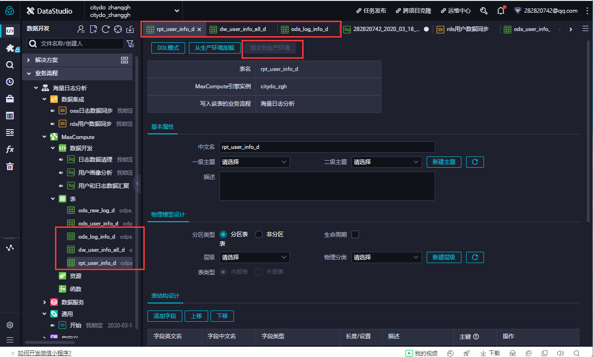
    - #### 完成上面操作后，下载jar包文件：http://docs-aliyun.cn-hangzhou.oss.aliyun-inc.com/assets/attach/85298/cn_zh/1532163718650/ip2region.jar?spm=a2c4g.11186623.2.24.10504b1blSWTAl&file=ip2region.jar
    - #### 在资源栏右键新增上传下载的jar包，并上传至资源栏，右键新增函数，命名getregion
  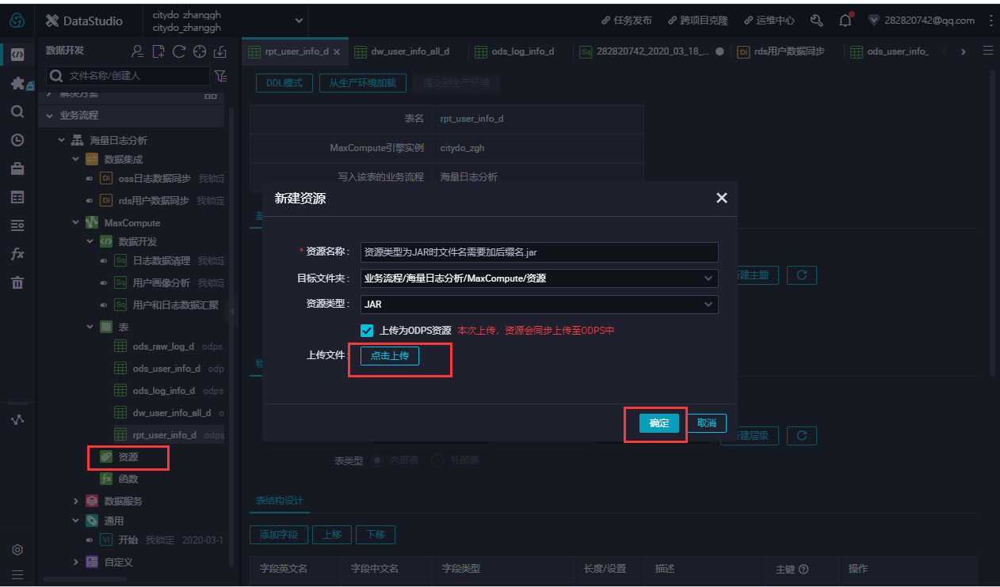
  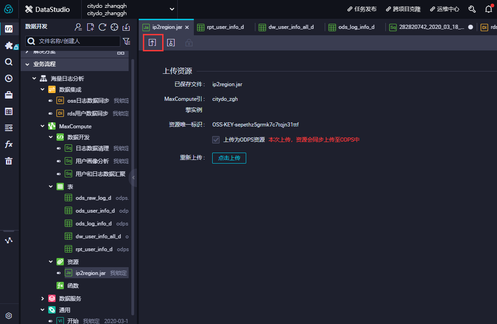
    - #### 根据帮助文档填写对应内容，点击保存；
    - #### 进入主界面双击进入对应sql表创建查询
  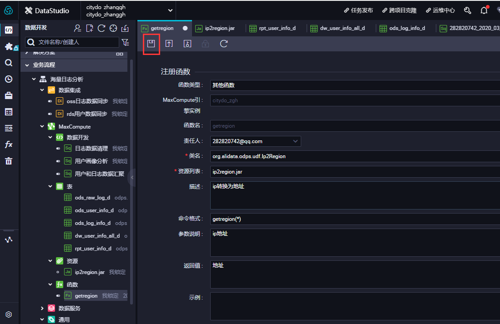
    - #### 配置ODPS SQL节点
      - 配置ods_log_info_d节点。双击ods_log_info_d节点，进入节点配置页面。在节点编辑页面，编写如下SQL语句。
    ```sql
    INSERT OVERWRITE TABLE ods_log_info_d PARTITION (dt=${bdp.system.bizdate})
    SELECT ip
      , uid
      , time
      , status
      , bytes 
      , getregion(ip) AS region --使用自定义UDF通过IP得到地域。
      , regexp_substr(request, '(^[^ ]+ )') AS method --通过正则把request差分为3个字段。
      , regexp_extract(request, '^[^ ]+ (.*) [^ ]+$') AS url
      , regexp_substr(request, '([^ ]+$)') AS protocol 
      , regexp_extract(referer, '^[^/]+://([^/]+){1}') AS referer --通过正则清晰refer，得到更精准的URL。
      , CASE
        WHEN TOLOWER(agent) RLIKE 'android' THEN 'android' --通过agent得到终端信息和访问形式。
        WHEN TOLOWER(agent) RLIKE 'iphone' THEN 'iphone'
        WHEN TOLOWER(agent) RLIKE 'ipad' THEN 'ipad'
        WHEN TOLOWER(agent) RLIKE 'macintosh' THEN 'macintosh'
        WHEN TOLOWER(agent) RLIKE 'windows phone' THEN 'windows_phone'
        WHEN TOLOWER(agent) RLIKE 'windows' THEN 'windows_pc'
        ELSE 'unknown'
      END AS device
      , CASE
        WHEN TOLOWER(agent) RLIKE '(bot|spider|crawler|slurp)' THEN 'crawler'
        WHEN TOLOWER(agent) RLIKE 'feed'
        OR regexp_extract(request, '^[^ ]+ (.*) [^ ]+$') RLIKE 'feed' THEN 'feed'
        WHEN TOLOWER(agent) NOT RLIKE '(bot|spider|crawler|feed|slurp)'
        AND agent RLIKE '^[Mozilla|Opera]'
        AND regexp_extract(request, '^[^ ]+ (.*) [^ ]+$') NOT RLIKE 'feed' THEN 'user'
        ELSE 'unknown'
      END AS identity
      FROM (
        SELECT SPLIT(col, '##@@')[0] AS ip
        , SPLIT(col, '##@@')[1] AS uid
        , SPLIT(col, '##@@')[2] AS time
        , SPLIT(col, '##@@')[3] AS request
        , SPLIT(col, '##@@')[4] AS status
        , SPLIT(col, '##@@')[5] AS bytes
        , SPLIT(col, '##@@')[6] AS referer
        , SPLIT(col, '##@@')[7] AS agent
      FROM ods_raw_log_d
      WHERE dt = ${bdp.system.bizdate}
    ) a;
    ```
    - 单击左上角的保存图标。
    - 配置dw_user_info_all_d节点。
      - 双击dw_user_info_all_d节点，进入节点配置页面。在节点编辑页面，编写如下SQL语句。
    ```sql
    INSERT OVERWRITE TABLE dw_user_info_all_d PARTITION (dt='${bdp.system.bizdate}')
    SELECT COALESCE(a.uid, b.uid) AS uid
      , b.gender
      , b.age_range
      , b.zodiac
      , a.region
      , a.device
      , a.identity
      , a.method
      , a.url
      , a.referer
      , a.time
    FROM (
      SELECT *
      FROM ods_log_info_d
      WHERE dt = ${bdp.system.bizdate}
    ) a
    LEFT OUTER JOIN (
      SELECT *
      FROM ods_user_info_d
      WHERE dt = ${bdp.system.bizdate}
    ) b
    ON a.uid = b.uid;
    ```
    - 单击左上角的保存图标。
    - 配置rpt_user_info_d节点。
      - 双击rpt_user_info_d节点，进入节点配置页面。在节点编辑页面，编写如下SQL语句。
    ```sql
    INSERT OVERWRITE TABLE rpt_user_info_d PARTITION (dt='${bdp.system.bizdate}')
    SELECT uid
      , MAX(region)
      , MAX(device)
      , COUNT(0) AS pv
      , MAX(gender)
      , MAX(age_range)
      , MAX(zodiac)
    FROM dw_user_info_all_d
    WHERE dt = ${bdp.system.bizdate}
    GROUP BY uid;
    ```
    - 单击左上角的保存图标。
  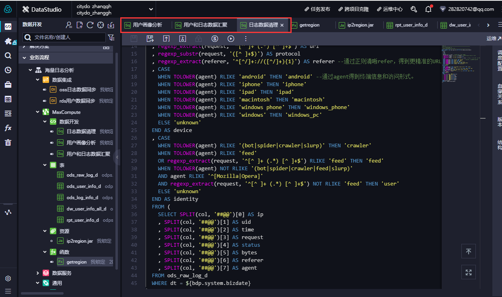
    - #### 返回主界面，右键点击运行，并查看日志
  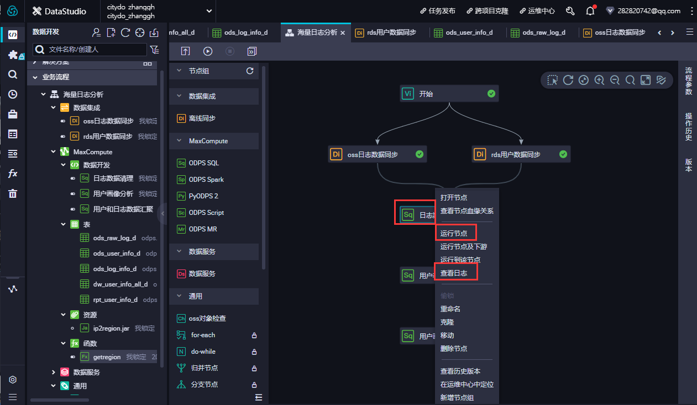
  
  
  
  
  


